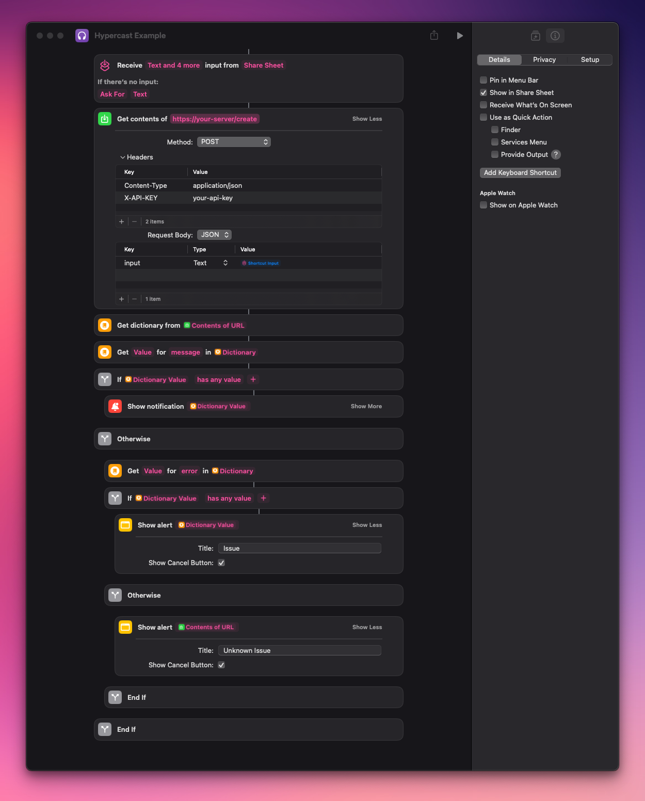

# Hypercast

A simple, personal podcast generator for turning articles into audio for offline listening.

## About

Hypercast was created to solve a simple problem: wanting to listen to interesting articles while walking or doing chores. It runs as a local service in my homelab, automatically converting articles to audio episodes that I can listen to later through any podcast app.

## ⚠️ Important Security Note

This application is designed for personal use in a controlled environment and should not be hosted publicly. It should only be accessed via:

- Local network
- VPN
- Overlay network (like Tailscale)

Running this service on a public server could expose your API keys, content, or system to unauthorized access.

## Features

- Convert text or URLs to speech using OpenAI's TTS service
- Automatic content cleanup using GPT
- Custom intro sound effects
- Dynamic RSS feed generation for podcast players
- Docker support for easy deployment
- Persistent storage for all media files and customizations

## Setup and Deployment

1. Clone and Configure Environment

   ```bash
   git clone https://github.com/chriscantey/hypercast.git
   cd hypercast
   ```

2. Set Up Environment Variables

   ```bash
   # Copy the example environment file
   cp .env.example .env

   # Generate an API token for authentication
   openssl rand -hex 32
   ```

   Edit .env and configure:

   - Add the generated token as API_TOKEN
   - Set your OpenAI API key as OPENAI_API_KEY
   - Adjust other settings as needed (see Configuration section below)

3. Production Deployment (with Docker)

   ```bash
   # Build and start the container
   docker-compose up -d
   ```

   The service will be available on the configured port (default: 4973)

   Note: I run this behind nginx with certbot SSL (even though internal).

4. Development Setup

   ```bash
   # Create and activate virtual environment
   python -m venv venv
   source venv/bin/activate  # or venv\Scripts\activate on Windows

   # Install dependencies
   pip install -r requirements.txt

   # Run with debug mode enabled
   FLASK_DEBUG=true python app.py

   # Or put this in the .env file
   FLASK_DEBUG=true
   ```

## Usage and Integration

### How I Use It

I use this tool to queue up interesting articles throughout the day, which are then converted to audio episodes. Later, while walking or doing chores, I can listen to these articles through my podcast app. The service runs in my homelab and is accessible when I'm away via VPN. My podcast app (Apple Podcasts) downloads the episodes automatically while I'm home, making them available offline when I'm out.

### Command Line

Create a new episode using curl:

```bash
curl -X POST http://your-server/create \
  -H "Content-Type: application/json" \
  -H "X-API-Key: your-api-key" \
  -d '{"input": "https://example.com/article"}'
```

Note: The `/create` endpoint requires authentication using an API key. Set your API key in the `.env` file.

### Podcast URL

Get the RSS feed:

```bash
curl http://your-server/feed
```

Use this URL in your Podcast app.

### Apple Shortcuts Integration

You can easily send articles to Hypercast from your iPhone, iPad, or Mac using Apple Shortcuts. The shortcut makes the same API call as the curl example above, making it convenient to send articles while browsing.

Here's an example shortcut implementation:



This provides a quick way to send articles to your personal podcast feed while browsing on your Apple devices. You can customize the shortcut to:

- Share directly from Safari
- Accept text input
- Run from the Share Sheet
- Add to your home screen

## Customization

The application comes with default media files that you can customize:

- **Podcast Cover**: Add your custom image to `app/static/images/` and set `FEED_IMAGE` in your `.env`

  - Example:
    ```bash
    # Add your image as app/static/images/my-podcast-cover.png
    FEED_IMAGE=my-podcast-cover.png
    ```
  - Recommended size: 1400x1400 pixels
  - Format: PNG or JPG

- **Intro Sound**: Add your custom audio to `assets/` and set `FEED_SOUND` in your `.env`
  - Example:
    ```bash
    # Add your sound as assets/my-intro.mp3
    FEED_SOUND=my-intro.mp3
    ```
  - Format: MP3
  - Recommended length: 2-3 seconds

Default files (`app/static/images/podcast-cover.png` and `assets/intro-sound.mp3`) are included as references and fallbacks. Adding your custom files separately allows for easier updates via git pull without conflicts.

## Credits

- Intro sound: "Simple Notification" by Universfield (https://pixabay.com/sound-effects/simple-notification-152054/)
- Podcast cover: AI generated image

## Contributing

This is a personal project that solves a specific need, but there are several areas that could use improvement:

- Content Scraping: The current implementation is basic and could be enhanced to better handle various article formats and websites
- Content Cleanup/Filtering: The text processing pipeline and GPT prompt used for cleanup could be optimized for better results
- Additional Features: Ideas welcome for improving the personal podcast experience

Contributions welcome!

## License

MIT License
